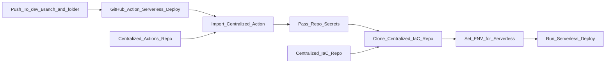

# OpsWrangler - Hello World
This product doesn't do much on it's own. It only exists to be something for a **shared GitHub Actions** and **shared IaC module** approach to build infra.

### 🤔Why?

- By segregating the Actions and Modules into their own centralized repos, we can ensure Actions' and Modules':
  - Reusability
  - Security
  - Standards
- Yes the DevOps team has involvement with these repos but are not meant to be blockers. These repos signify a segregation of duties, and PR's should be designed for multiple teams to have input: product team, security, architecture, network, spend...

### 🗒️How?

- The product team clones an example `stack.file` to their repo

- The product team copies an GitHub Actions 'client.yml' that calls a shared GitHub Action

- The pipeline in the dev branch looks like this:

- Additionally the approach is engineered to allow for local work. The centralized IaC repo just needs to be cloned next to the product folder.

### 🌩️Serverless Framework?

- Serverless Framework has a few different uses, one of which is an enhanced client for CloudFormation
- CloudFormation is an AWS native and primitive tool, and was their first IaC tooling. It can be used to describe all infra in AWS
- The YAML in `serverless.yml` is easier to [validate](https://cuelang.org/docs/integrations/yaml/) vs. other languages
- We can pivot from this as we grow
