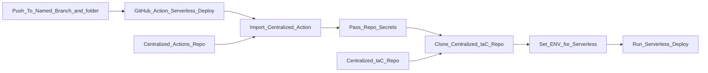

# OpsWrangler - Hello World
This product doesn't do much on it's own. It only exists to be something for a **shared GitHub Actions** and **shared IaC module** approach to build infra.

### 🤔Why?

- By segregating the Actions and Modules into their own repos, we can ensure Actions' and Modules':
  - Reusability
  - Security
  - Standards

### 🗒️How?

- The product team copies an example IaC 'wrapper' file that describes their infra. At the moment we use Serverless Framework which exposes a single `serverless.yml` for this purpose.

- The product team copies an GitHub Actions 'client' that calls a shared GitHub Actions

The pipeline looks like this:

