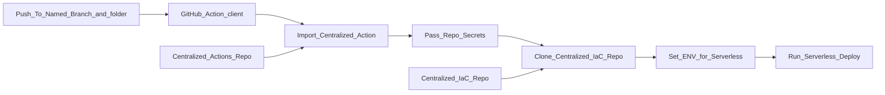

# OpsWrangler - Hello World
This product doesn't do much on it's own. It only exists to be something for a **shared GitHub Actions** and **shared IaC module** approach to build infra.

### 🤔Why?

- By segregating the Actions and Modules into their own centralized repos, we can ensure Actions' and Modules':
  - Reusability
  - Security
  - Standards
- Yes the DevOps team has involvement with these repos but are not meant to be owners or blockers. These repos signify a segregation of duties, and PR's should be designed for multiple teams to have input: product team, security, architecture, network, spend...

### 🗒️How?

- The product team clones an example `stack.file` to their repo

- The product team copies an GitHub Actions `client.yml` that calls a shared GitHub Action, to their repo

- The pipeline in the looks like this:

### 🙌Democratizing DevOps

- In the `dev` branch and environment, the shared pipeline will use the `stack.file` in the product repo, allowing for early adoption and iterations of devs building their own IaC stack
- The devs then make PR's to get their stack and shared module changes to the Shared IaC repo. The `stack.file` can be versioned (tagged)
- PR's are instigated (security, standards, etc.) and approved
- In the `QC` and higher branches, the pipeline will use the `stack.file` and shared modules in the Shared IaC repo only

